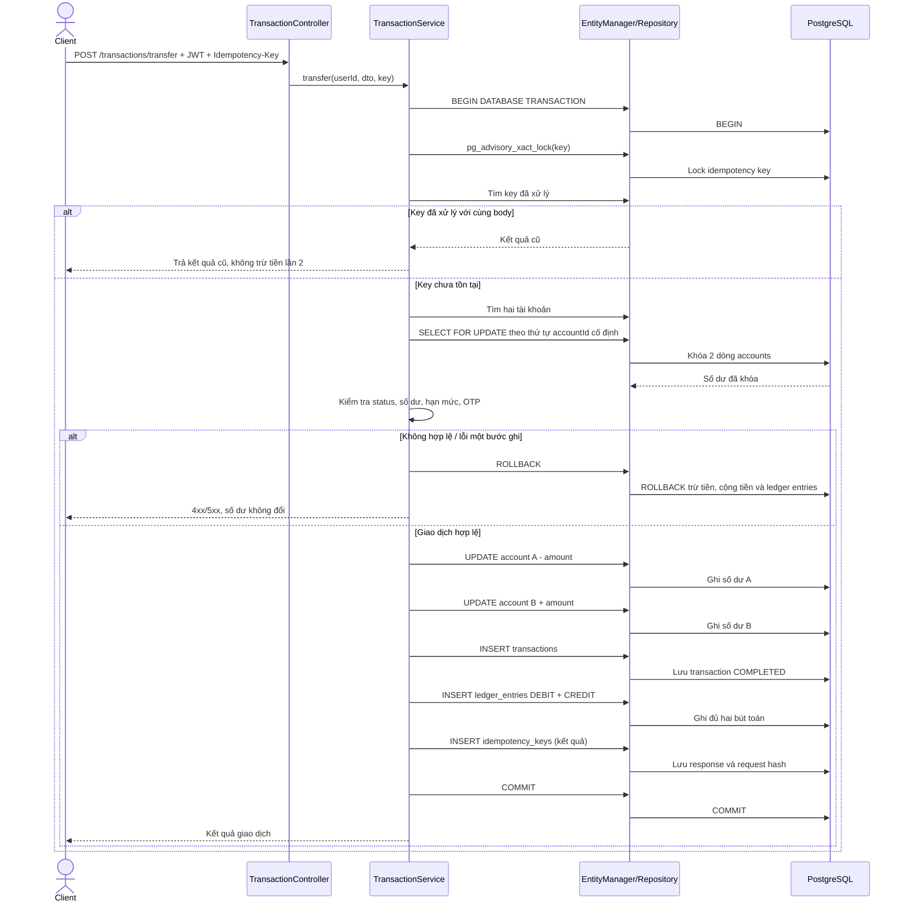

# Sequence diagram

## 1. Đăng nhập bằng JWT

```mermaid
sequenceDiagram
  actor Client
  participant Controller as AuthController
  participant Service as AuthService
  participant Repository as User Repository
  participant Database as PostgreSQL
  participant JWT as JwtService
  Client->>Controller: POST /auth/login (email, password)
  Controller->>Service: login(dto)
  Service->>Repository: findByEmailWithPassword(email)
  Repository->>Database: SELECT user và password_hash
  Database-->>Repository: User
  Repository-->>Service: User
  Service->>Service: bcrypt.compare()
  alt Thông tin không đúng / tài khoản bị khóa
    Service-->>Controller: 401 Unauthorized
    Controller-->>Client: Lỗi đăng nhập
  else Hợp lệ
    Service->>JWT: signAsync(userId, role, tokenVersion)
    JWT-->>Service: JWT access token
    Service->>Database: INSERT refresh_sessions (token hash)
    Database-->>Service: OK
    Service-->>Controller: User an toàn + JWT + refresh token
    Controller-->>Client: JWT trong body; refresh trong HTTP-only cookie
  end
```

## 2. Chuyển khoản nội bộ, idempotency và rollback



Nhánh OTP: yêu cầu từ 10 triệu đồng trở lên được ghi `PENDING_OTP` trước, **chưa trừ tiền**. Khi xác nhận OTP hợp lệ, backend khóa tài khoản và xử lý chuyển khoản trong transaction tương tự sơ đồ trên.
